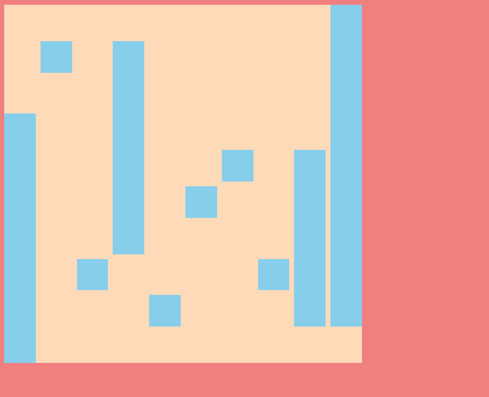
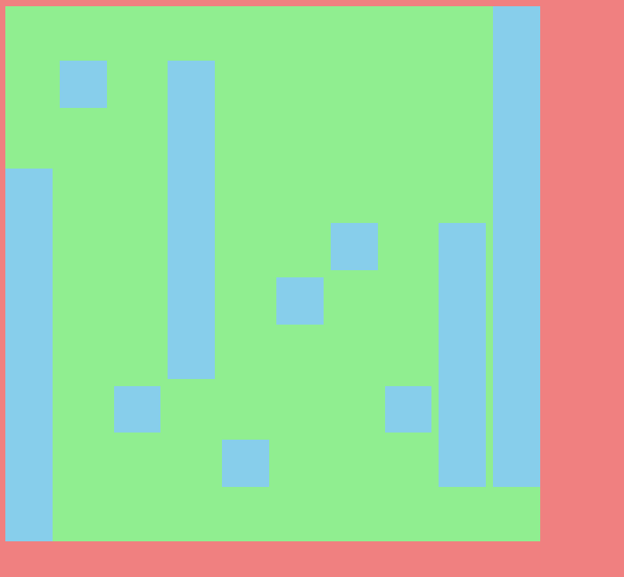

# Hofmann-Yes

Inspired by Armin Hofmann's book "Graphic design manual", I decided to give it color and interaction to his designs using Java Script and the P5js library watching a lot of tutorials from [The coding train](https://www.youtube.com/user/shiffman). This page is special to me because it is one of the first ones I made in 2018 when I became interested in the web as part of my artistic practice.

### How does it work?  
Each time we reload the page, the Hoffman's pattern changes.
When the mouse hovers on our background, the color changes. 

Check this site [here](https://hofmann-yes.glitch.me)

[P5.js](https://p5js.org/) is a JavaScript library for creative coding, with a focus on making coding accessible and inclusive for artists, designers, educators, beginners, and anyone else! p5.js is free and open-source because we believe software, and the tools to learn it, should be accessible to everyone...

